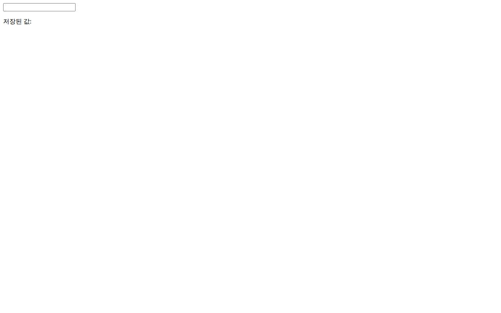
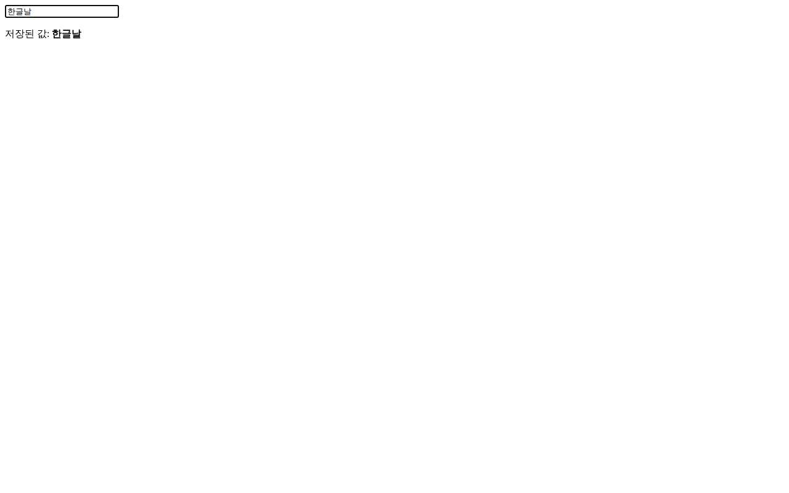

# 작업 절차서 (walkthrough)

> 웹 자동 테스트 리포트 · 2026-08-10 05:05:51 자동 생성
> 이미지는 상대 경로입니다 — 이 실행 폴더째 옮기거나 옵시디언 볼트에 넣으면 그대로 렌더링됩니다.
> 통과 시나리오는 기능 사용 절차서로, 실패 시나리오는 버그 재현 절차서로 활용할 수 있습니다.

## 1. 한글입력-fill방식 — 통과
에디터에 '한글날'을 입력하면 그대로 남아야 한다

1. / 페이지에 접속한다
   
2. '#editor'에 '한글날'를 입력한다
   
3. '#saved' 요소의 텍스트가 정확히 '한글날'인지 확인한다
   

→ **결과: 통과**
